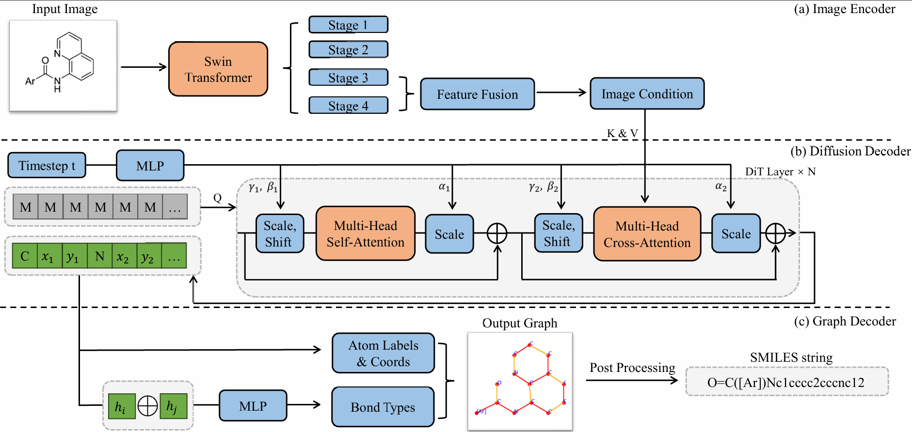

# MolDiffusion

**MolDiffusion: Optical Chemical Structure Recognition with Discrete Diffusion**



<div align="center">
Overview of the proposed MolDiffusion framework.
</div>

---

## Overview

MolDiffusion is a discrete diffusion-based framework for Optical Chemical Structure Recognition (OCSR). Given a molecular image, the model progressively refines a fully masked token sequence and predicts the corresponding molecular structure representation.

This repository provides:

- Training and evaluation code
- Pretrained model checkpoints
- Inference scripts for molecular image recognition
- Data preparation instructions
- Benchmark evaluation pipelines

---

## Installation

### Clone the repository

```bash
git clone https://github.com/wlzhao22/moldiffusion.git
cd moldiffusion
```

### Create a conda environment

```bash
conda create -n moldiffusion python=3.10
conda activate moldiffusion
```

### Install dependencies

Using pip:

```bash
pip install -r requirements.txt
```

or create the environment directly:

```bash
conda env create -f environment.yml
conda activate moldiffusion
```

---

## Quick Start

### Python API

```python
import torch
from moldiffusion import moldiffusion

image_path = "./examples/1.png"
model_path = "./ckpts/moldiffusion_best.pth"

device = torch.device("cpu")

model = moldiffusion(model_path, device)

results = model.predict_final_results(
    image_path,
    return_atoms_bonds=True
)

print(results)
```

### Notebook Example

An interactive notebook example is available in:

```text
prediction.ipynb
```

You may replace the image and checkpoint paths with your own inputs.

---

## Pretrained Models

The pretrained MolDiffusion checkpoint can be downloaded from Hugging Face:

[moldiffusion_best](https://huggingface.co/ycwan/moldiffusion/blob/main/moldiffusion_best.pth)

## Dataset Preparation

### Dataset Description

MolDiffusion is trained using both synthetic and real-world molecular image datasets.

- **MolParser-7M** is used for large-scale pre-training.
- **PubChem** provides synthetic molecular images generated from molecular structures.
- **USPTO** contains molecular images collected from patent documents and serves as a realistic training dataset.
- **Indigo** and **ChemDraw** are synthetic benchmark datasets rendered using different chemical drawing engines.
- **CLEF**, **UOB**, **USPTO**, **JPO**, **Staker**, and **ACS** are real-world benchmark datasets collected from scientific publications and patents.
- The **Perturbed Benchmark** introduces additional image transformations to evaluate robustness against image degradation and distortions.

The datasets listed below are publicly available from previous OCSR studies. We thank the original authors for making these resources publicly accessible. Please cite the corresponding original publications when using these datasets.

### Pre-training Dataset

[MolParser-7M](https://huggingface.co/datasets/UniParser/MolParser-7M)

### Training Datasets

[PubChem-1M](https://huggingface.co/yujieq/MolScribe/blob/main/pubchem.zip), [USPTO-680k](https://huggingface.co/yujieq/MolScribe/blob/main/uspto_mol.zip)

### Benchmark Datasets

#### Synthetic Benchmarks

[Synthetic](https://huggingface.co/datasets/CYF200127/MolNexTR/blob/main/synthetic.zip)

#### Real-world Benchmarks

[Real](https://huggingface.co/datasets/CYF200127/MolNexTR/blob/main/real.zip)

#### Perturbed Benchmark

The perturbed benchmark contains additional image transformations applied to the real-world benchmark datasets.

Download:

[Perturb](https://huggingface.co/datasets/CYF200127/MolNexTR/blob/main/perturb_by_imgtransform.zip)

---

## Training

To train MolDiffusion:

```bash
sh exps/train.sh
```

Training hyperparameters can be modified in the corresponding experiment scripts.

---

## Evaluation

To evaluate a trained checkpoint:

```bash
sh exps/eval.sh
```

Benchmark results will be saved to the specified output directory.

---

## Single Image Prediction

Run inference on a custom molecular image:

```bash
python prediction.py \
    --model_path your_model_path \
    --image_path your_image_path
```

---

## Model Checkpoints

Place pretrained checkpoints in:

```text
ckpts/
```

Example:

```text
ckpts/
└── moldiffusion_best.pth
```
